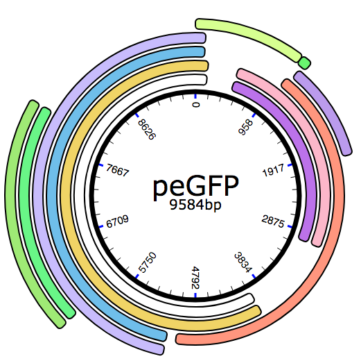
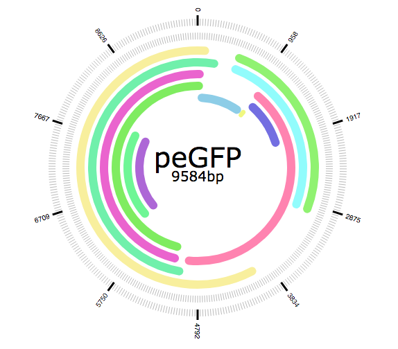

# ReactPlasmid

A small react library for displaying plasmids.

## Gallery





## Requirements

not sure yet...

## Installation

probably...

```bash
yarn install
```

## Desired features

Wanted features:
* DNA Annotation + Tooltip
* DNA highlighting
* styling and formatting
* labeling
* rotate
* baseviewer
* primer display
* enzyme sites

## Running

```bash
yarn start
```

Then navigate to http://localhost:3000 in your browser